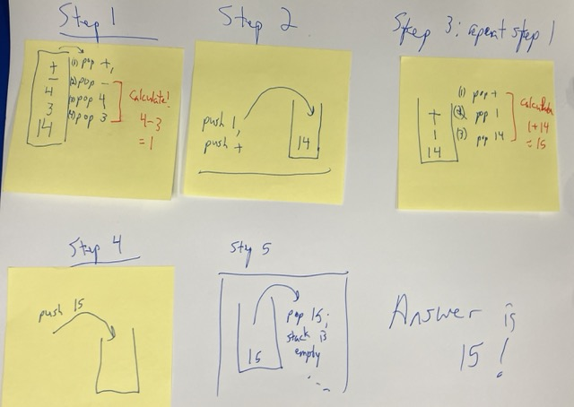

Implement the a calculator for prefix and postfix operations.
<!--more-->

Familiarize yourself with the [basics of the assignments](../basics/) and ask questions if you have them!

## The assignment:

You will write a calculator that can compute prefix and postfix notation depending on input. If the input begins with an operator, it’s prefix. If the line begins with a number, it’s postfix.

Note: You shouldn’t store values using ints. If we divide, ints lose decimal values. Do you computations with `float`s or `double`s. Further, the numbers will not be single characters. You should parse the string by splitting at spaces, not `char` by `char`


## Input 
One or more lines of computations, properly formatted in pre- or post-fix, with everything separated by spaces

```
+ 4 - 1 * 3 5
3 2 + 1 - 8 /
8 7 / 14 * 
```

[Here is a sample test file](./calcTestData.txt)

## Output
To `stdout`, the answer to each question, one line per answer

For the above example: 

```
-10
0.5
16
```

## Roughly how I implemented the code: 

### Prefix:
For the prefix calculator, I used a stack data structure and popped values off until I got an operation, followed by two numbers. Then I did the calculated the result and pushed everything back onto the stack: 

Input:
`+ - 4 3 14` 



### Postfix
For the postfix calculator, I used a list with a recursive function with the following idea: 
1. We always compute the first three items on the list, if there are three items
2. Then we need to pass our computation as the new front of the list and compute the rest.
3. We'll stop when the result has fewer than three items - it's just a number, the answer

Example: (without commas or brackets, underlines are the new numbers)
```
compute(3 2 + 1 - 8 /)
= compute(_5_ 1 - 8 /)
= compute(_4_ 8 /)
= compute(_0.5_)
= 0.5
```

## Floating point representation 


Not all number have good floating point representations.  


For example, type this into the python interpreter:
```
>>> 0.1 + 0.2
```
You’ll see
```
0.30000000000000004
```

So that we don’t have to worry about representation in this assignment (that’s not the point), if you print to stdout the number 0.30000000000000004, my checker will be smart enough to know that your calculation should be 0.3.  I will compute `abs(your answer - mine) < 0.001`.


## Submitting

Post your source file to the assignment in Blackboard. If there's necessary (nonstandard) headers or supplemental files, be sure to include them. Please also tell me how you compiled your assignment (maven, g++, javac) if relevant.