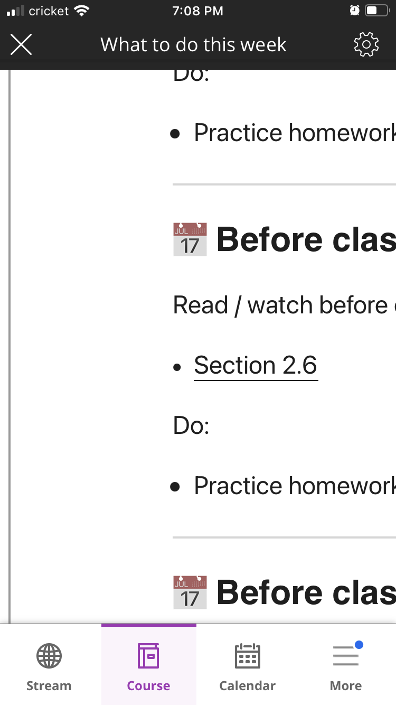
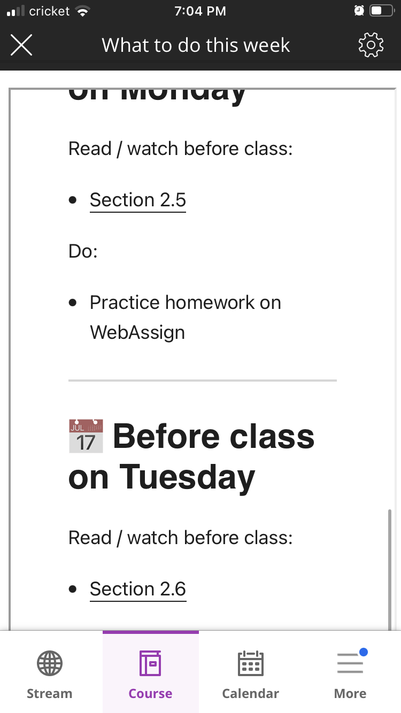

I've spent the last week trying to improve my site's presentation of material for my calculus students.  What really irked me was how unprofessional my non-responsive images looked when I'd go in the classroom and see my site rendered on their phones.

So I added `lightbox2` javascript library, I used Hugo's automatic generation of smaller images (for faster load times), and changed the positioning CSS.  I felt really proud because it looked great on the laptop (Safari and Firefox) and on mobile. Hooray!

So I shared this with my calc class today, letting them know about the changes and how I hope it's a better user experience. I then asked, "is there anything about the site that is interfering with your learning?" 

"Yes! The videos don't allow me to load them in full screen."  😲

... but it worked on my iPad in the classroom, and it worked on my laptop. But other students said the same thing. Everyone was using a chromium-based browser, so I said I'd install Chrome and test it out.  

I couldn't replicate it.  It worked fine with extensions, no extensions, private window, etc... Finally, it clicked.

I've been accessing the page via `jmhammond.github.io`, whereas my students are accessing it via an `iframe` on our LMS, Blackboard. So I head over to blackboard and see it: 


The a-ha moment is that if an `iframe` is inside another `iframe`, the outer frame *must* have the `allowfullscreen` property enabled for full screen to work.  So I fixed it and now they can do full screen: 


The lesson: ask your students if there's any technological sticking points that interfere with their learning. You might be surprised what you missed!

---

But I wasn't done there. Since the students are accessing Blackboard on their phones, I realized that I'd never done that.  I've only tested my content outside blackboard. So I installed the Blackboard Learn app, log in, open my course, and find this:



What you see there is a page that is *wildly unoptimized* for mobile. It is awful, and students have to scroll left/right just to read anything on that page.  And I've been recycling this same iframe code over the last three semesters. No one told me it looked like garbage! 

The offending code used fixed dimensions that I hacked together because Blackboard is terrible, and this allowed it to look good on my laptop: 
```html
<iframe width="1024" height="1200"   ... >
```

I just needed to change the width to `100%` and earlier I'd added `allowfullscreen`, and now I've solved both problems. Blackboard is appropriately responsive:



and everything renders nicely! 

--- 

And a bonus was that in exploring this, I found the default Hugo youtube shortcode had additional calls to Youtube to fetch information about the video that I didn't need, so [I've created my own shortcode](https://github.com/jmhammond/math-courses/blob/main/layouts/shortcodes/youtube.html) that loads everything using the `www.youtube-nocookie.com` url for privacy and appends the `?rel=0` parameter that seems to (miraculously!?) be working again.  

I'm happy with how everything is working and behaving. Removing extra calls means the quickly loading pages is even faster. This is a win for everyone!