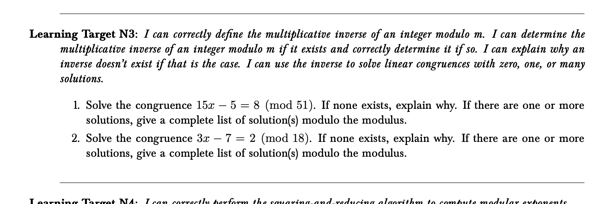
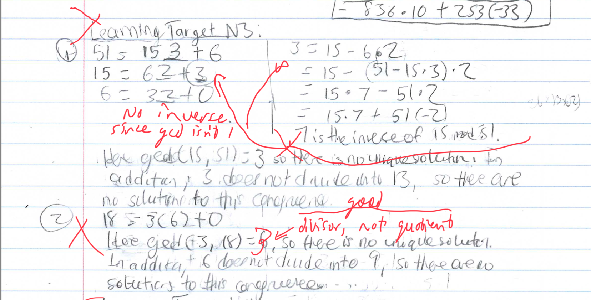
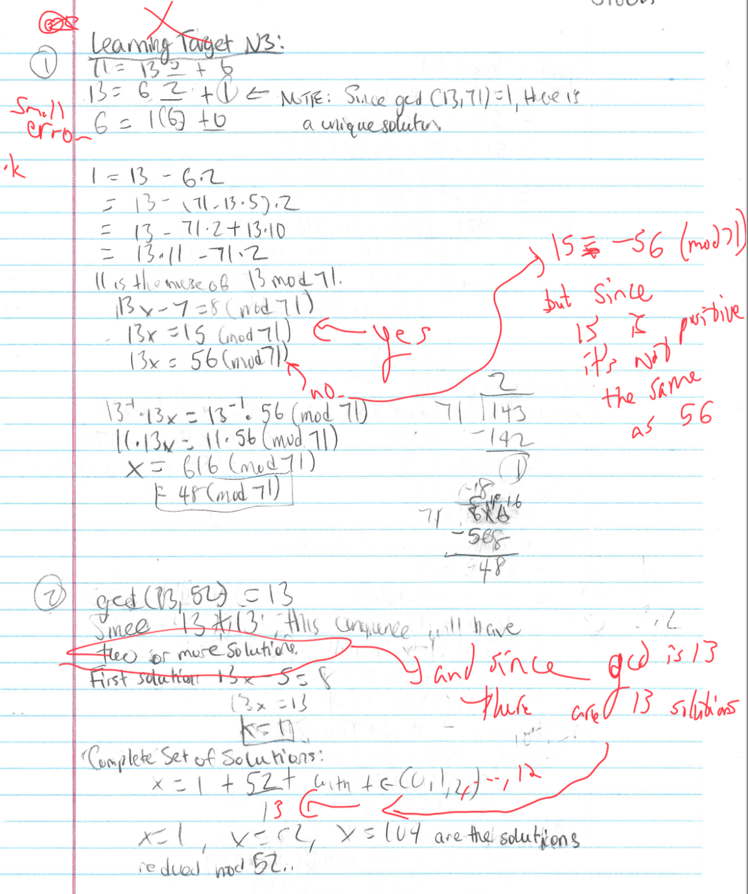
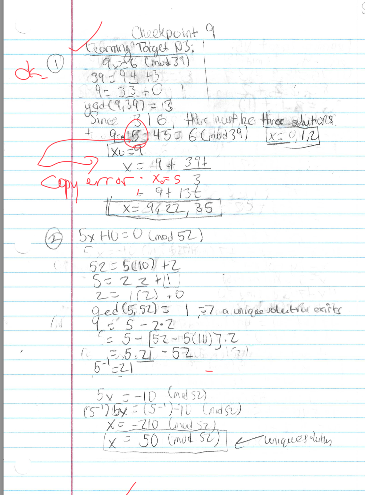
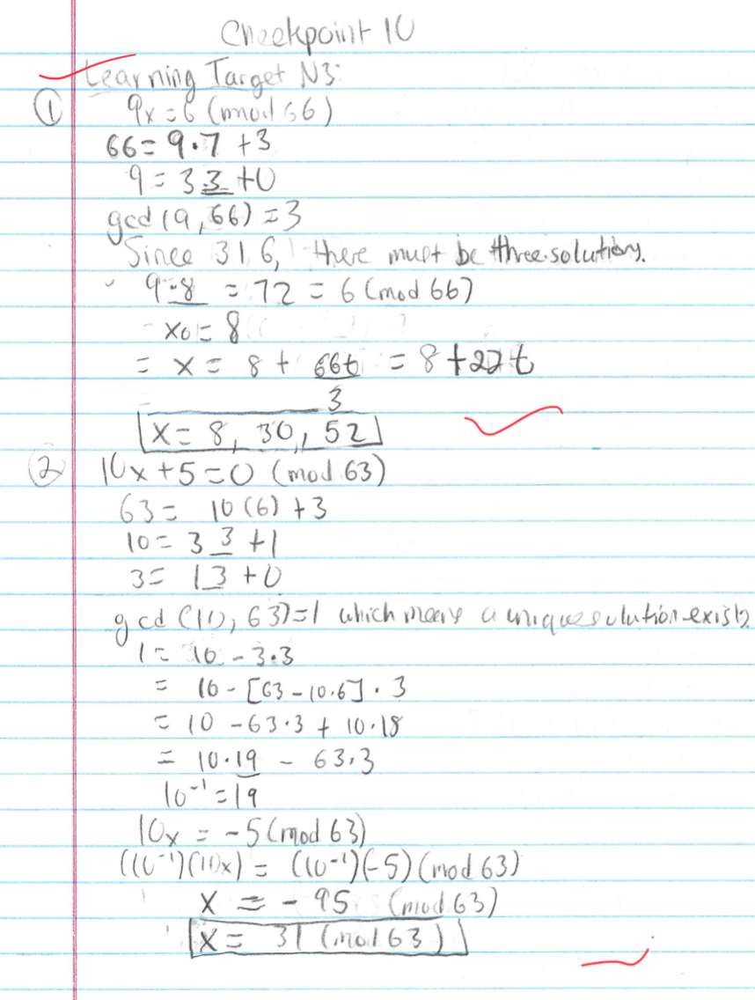

+++
title = "Non-traditional Grading: Mastery-based grading"
tags = ["teaching", "grading"]
date = 2023-01-31
draft = false
mathjax = true
hideMeta = false
ShowCodeCopyButtons = true
ShowBreadCrumbs = true
+++

Want students to learn more? Try grading differently.
<!--more-->

You've likely been using a standard "A is 90, B is 80" style of grading, and you've almost certainly had students come to you at the end of the semester saying, "I have an 89.1%, can you round it up to an A?"

I haven't gotten that question in a couple years, and it's been wonderful.  How?  I don't use the common percentage-based grading system. 

### A motivating example

Let's start off with a motivating example to get you thinking about this.  Consider this example, solving a linear equation: 
$$\begin{align*} 2x + 3 &= 7 \\\\ 2x &= 2 \\\\ x &= 1 \end{align*}$$

Let's pretend that this question is worth 10 points.  How many points will you give? 

Got an answer? Why is the question even worth 10 points?  It's only two lines of work.  So maybe we should just make it worth 2 points... buth then if they make a mistake did they fail (50%)? 

What are we actually trying to measure with this question? 
- Are you testing to see if students can do arithmetic?  If so, they failed ($7-3 \ne 2$).
- Are you testing if students can find solutions to equations?  If so, they failed again, since 1 isn't the solution.
- Is the question just busy work because you wanted to add more questions to a timed test or give them "easy points"?   I am guilty of this...

### Motivation for unconventional assessment
Alfie Kohn writes[^1] of grades: 
- Grades tend to reduce students’ interest in the learning itself.
- Grades tend to reduce students’ preference for challenging tasks.
- Grades tend to reduce the quality of students’ thinking.
- Grades aren’t valid, reliable, or objective.
- Grades distort the curriculum.
- Grades waste a lot of time that could be spent on learning.
- Grades encourage cheating.
- Grades spoil teachers’ relationships with students.
- Grades spoil students’ relationships with each other.

[^1]: Kohn, A. (1999). From Degrading to De-Grading. High School Magazine, 6(5), 38–43.

This rings true, even 24 years after that article was published. 

### Varieties of unconventional grading that I'm doing
There are many different ways to change how you grade.  Keep an eye out for the upcoming book *Grading For Growth* by Robert Talbert and David Clark to dig into more details of the varieties.   

In this post, I'm going to explain how I use "master-based testing" in my *mathematics* courses. (in contrast with my *history* of mathematics course, which will be discussed in a second post). 

#### Before the semester
Begin by defining the learning outcomes for the course.  Everything in your course is tied to the learning outcomes.  ['Here's the learning outcomes](https://docs.google.com/document/d/1Scukc_HmvjnKtdJNzJ-sB5OxqMXjap73lMmwrHz-9sY/edit) for my calculus 1 course, for example.

In "Shocker Yellow," you'll see what the objectives as laid out by my department, and below you'll find individual "learning targets" that connect to the material, and below each of those, how they will be presented and what is expected of the student. 

Let's take the example of "DA3: I can use the Extreme Value Theorem to find the absolute maximum and minimum values of a continuous function on a closed interval."   The students will be presented with a question on their weekly quiz such as: 

> Consider the function  $f(x) = x^2 - x^3$ on the interval $[-1,4]$ find only the absolute maximum and minimum values (extreme value theorem).

I want to make the point that those learning targets influence the content we cover in the course and [the calendar / pacing](https://docs.google.com/document/d/1Ul_HA0J7XjOy4LY-MtyIRYPLZ724jka81AmCHHJ-s0w/edit#bookmark=id.yctoyj5hikul). 

#### During the semester

I write new questions for the learning targets that will be assessed in the week.  By my own choice, I give weekly "checkpoint" quizzes in which the students are assessed on the material. Each learning target has one or more questions that must be completed correctly in order to receive credit.  I give feedback to students who get something incorrect, but all solutions for a topic must be "right" for credit on the learning target.  Otherwise they can do it again next time!

Here's a specific student example from my discrete mathematics class. The question looks like this: 

The student's work on checkpoint number 7 looks like this: 

They were totally wrong, but they had good structure.  The next week, here is their work:

Here some of it is good, but it's wrong in new ways. Next week, they present this solution:

... this is so close!  And then the next week:

Great job, student! You got it!

#### Here's my personal weekly schedule

This is a large workload, so here's my weekly plan I have for keeping up with the workload (just for the assessments, separate from class prep, administrative duties, etc):
- "Mondays are awful."  It's my motto for grading days. I commit to getting *everything* graded on Monday. Sometimes I'm done by 1pm, sometimes it's 11pm.  It's a "bad" day, but it gives me freedom the rest of the week.
- Tuesdays are for writing questions (two weeks ahead is ideal)
- Wednesdays are for proofing/checking the week's assessments.
- Thursday the weekly assessment goes live.
- Friday is "Dad day" and I commit to not doing work (outside teaching a class) so I can otherwise be with my kids.
- Saturday and Sunday are family day. 

This really means my hard day is Monday, and I make sure everyone (my students, my family, my chair) know that I'm usually not available on that day.  But it means I have a very flexible schedule / freedom the rest of the week. I'm writing this on a Tuesday morning (and I have time for it!)

#### Why it's worth it

Here's some quotes from student evaluations:  

>The checkpoint and mastery system are fantastic. Less stress, encourages learning through mistakes, personalized education, and detailed feedback. I wish more math classes used this format

>I loved the grading style and weekly checkpoint style.

>Mastery grading actually motivated me to learn a subject after I missed it on an assignment because I knew I that I could make it up and that made me want to fully understand the subjects and concepts taught.

... and isn't getting students to *want* to learn the material the dream? 

