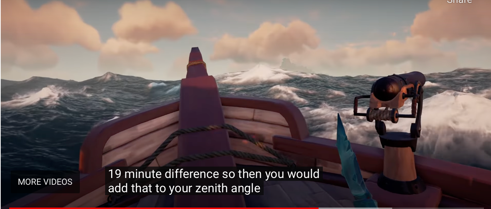

+++
title = "Non-traditional Grading: Ungrading"
tags = ["teaching", "grading"]
draft = false
mathjax = true
hideMeta = false
date = 2023-02-01
ShowCodeCopyButtons = true
ShowBreadCrumbs = true
+++

How does a student "get 75%" of a 50 minute exploration that even Achimedes never solved in his lifetime? 
<!--more-->

In my [previous post](./non_traditional_grading1), I described how I'm using mastery-based grading in my math courses. This post explores how I'm not grading in my history of mathematics courses.

### "Not grading???"

Yes. In my syllabus I include the line: 

> **I will not be grading your work**

and I follow up with:

> Instead, I'll be giving you the freedom to explore and do your best work. I'll be giving you feedback without the rating/judgment

> We will be working collectively as a class to explore, learn, and discover the beauty within the development of our field of mathematics. You’ll read the readings, do suggested activities, write papers, etc, then at the halfway mark and at the end of the semester, you’ll write a brief achievement essay in which you determine, based on your own judgment, what your letter grade should be and why.

### "Doesn't everyone get an A?"

Surprisingly no.  But also, who cares if they do? 

### Why I do this in history of mathematics

First, I've taught these courses a lot! In fact it has been 20% of all the classes I've taught over the last decade.  

The class is somewhat of a "capstone" for an *appreciation* of mathematics. It's not what anyone thinks of as a math class -- my wife calls it my "liberal arts" course. I used to call it the "hardest easy A" class because I have very high expectations for students that I believe everyone can achieve.

And because I believe that, I decided about 3 semesters ago to let the students do their best work.

### What kind of assingments? 

Okay, first off, this isn't a "math" class. Yes, we solve problems. Yes, there are proofs. But we also read. A lot. Over the course of the semester read our assigned text[^1] cover-to-cover; many articles (as PDFs on Blackboard).  We have:
- Daily reading responses and reading discussion
- Daily written exercises exploring the mathematics about which they read.
- Students write biographies of (at least) two mathematicians
- Students write a "biography of a topic"
- They give several presentations on their topics (there are at a minimum 5 presentations for each student over the course of the semester)
- We have frequent "hands-on" activities during class exploring things as diverse as writing cuneiform numbers on modeling clay with stylus, implementing an Incan *yupana* computing device, trying to independently prove number theory claims by using stacking blocks,....

[^1]: Berlinghoff, W. P., & Gouvêa, F. Q. (2015). Math Through the Ages: A Gentle History for Teachers and Others. American Mathematical Society.

But how do you grade this?  What does a 90% presentation look like?  How does a student "get 75%" of a 50 minute exploration that even Achimedes never solved in his lifetime? 

Since ungrading, I just give the students the framework that "these are my basic expectations and requirements. Do your best, creative work."

### Really neat projects and presentations

I've had several phenominal presentations. Here's some samples aren't "favorites" so much as just really unique that stand out when I'm typing this:
- A student created a sextant and used it to calculate his position when he was on a dark field at night in rural Kansas.  (His handmade creation of cardboard and string was obviously inaccurate, but it was closer than you'd expect!)
- In a related topic, another student gave a history navigation but told as a voiceover while he was playing *Sea of Thieves*

- Another student dug into the history of probability as a means to get ahead in games of chance, discovered a method of card counting and gave a presentation on these topics.  She also practiced the method and reported that she won money at a local casino the weekend before her presentation. 
- ... there's so many more. I just love this class.

### Want to learn more?

This editted collection shows how ungrading can look in K-12 and higher education. It's a highly recommended read (links to amazon):

[Blum, S. D. (Ed.). (2020). Ungrading: Why Rating Students Undermines Learning. West Virginia University Press.](https://www.amazon.com/Ungrading-Students-Undermines-Learning-Education/dp/1949199827)

And here are a couple articles from popular ed websites about getting started:

Flaherty, C. (2019, April 2). Professors’ reflections on their experiences with “ungrading” spark renewed interest in the student-centered assessment practice. https://www.insidehighered.com/news/2019/04/02/professors-reflections-their-experiences-ungrading-spark-renewed-interest-student

Miller, M. D. (2022, August 2). Advice | Ungrading Light: 4 Simple Ways to Ease the Spotlight Off Points. The Chronicle of Higher Education. https://www.chronicle.com/article/ungrading-light-4-simple-ways-to-ease-the-spotlight-off-points

I need to learn more myself! Reading over student evaluations from Fall 2022 tells me that I need to provide more *written* feedback -- verbal isn't enough.  Thankfully, I'll get to teach the class again and hopefully we'll all do our best work.

<!-- for a future post 
### What do I need to do differently going forward?

Looking over my Fall 2022 student evaluations, the number one comment is that they wanted more *written* feedback. That's definitely fair. Although I gave lots of verbal conversations with them after presentations or submitted papers, I tended to speak it not to write it.  This suggests to me that "ungrading" next time will still need written comments. 

//-->