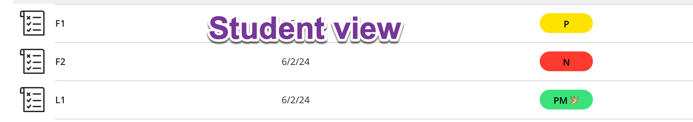

After finished reading a [post about simplifying a discrete course on the Grading for Growth blog](https://gradingforgrowth.com/p/three-ways-i-am-simplifying-my-alternative). I based my own courses off your original iteration, and I wanted to share a neat ‘innovation’ that I’ve done exploiting neat feature in the Blackboard gradebook.


Want to know more about mastery grading? [Check this post for a little more information](../../../2023/non_traditional_grading1/)


First, create a “[Grading Schema](https://help.blackboard.com/Learn/Instructor/Ultra/Grade/Customize_Grading_Interface/Grading_Schemas)." I call mine mastery.

- Blackboard requires numeric values for grades, but the schema will present text entries. 
- It also colors the values! 
- I use a 4 point scale, with 0 being “N” (red),  3 being “P” (yellow), and 4 being “PM🎉” (green) with meaning from your original grading system.

Next, create each learning target column in the gradebook to have that schema.  The teacher view looks like this after two attempts: 



Each entry is actually a number (uploaded from a spreadsheet), but the students never see that:



And the magic is that in the Student View, students are given not just letter clues, but color cues for how they’re doing:

Last semester, I had students come up to me and say “I still need to get a skill green!”  I didn’t realize what an impact that had. We mostly stopped talking about the letter code and used colors.  (Though for my color blind student this semester, the letter codes are still essential)  

This is a small thing, but I really grew to like the “stop light” grading after one semester.  I wanted to share it with as a possibility to keep the two-levels without the complication of "1 and 2” levels.  

Of course, now that I think about it, I could further simplify it so rather than using codes like "P" and “PM” the schema could say “One More” and “Done! 🎉” Maybe that’s for next semester.