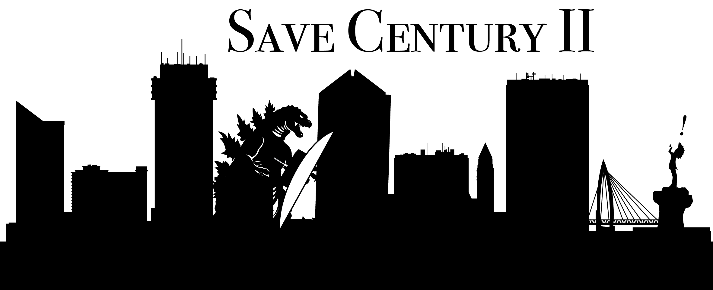

I was thinking about the "Save Century II" signs, and I got to wondering what would be a funny thing to save it from... Of course I landed on my favorite city-eating reptile, Godzilla, and I realized that I needed to make this and put it on coffee bottle.

I wanted to share the files in case any other Wichitans want an ironic sticker.

## Have a cricut? 

Here's a link to the SVG and PNG image that you can make your own:
- [SVG](./SaveCenturyII.svg)
- [PNG](./SaveCenturyII.png)

## Don't have a cricut?

[The Wichita Public Library has one](https://www.wichitalibrary.org/Services/Pages/cricut.aspx) you can use for free!  Bring your own vinyl and you can make your own, just reserve a timeslot from the library website.  

This is where I'm making my own!

## Just want to buy a sticker? 

You can do that, too, [via my Redbubble store](https://www.redbubble.com/i/sticker/Save-Century-2-Godzilla-by-SomeEpicPony/162525780.EJUG5?asc=u).  
