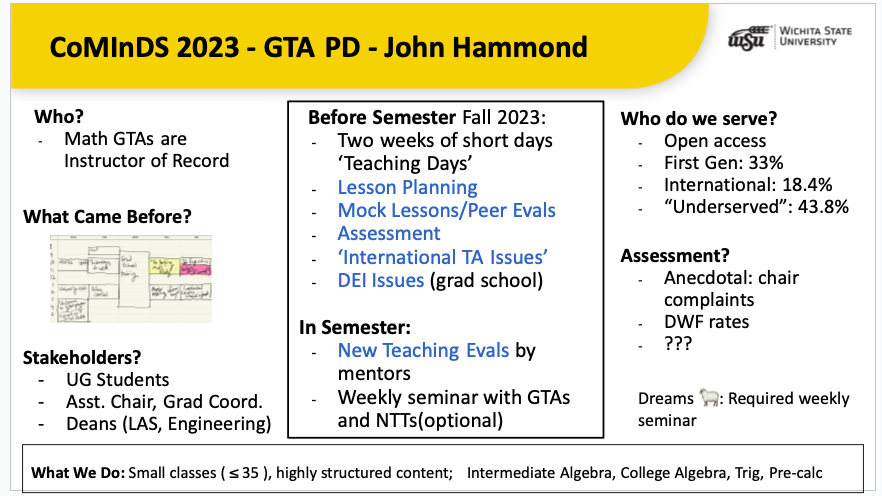

## The over-arching plan for the two week program

Mark Arrasmith (Senior Educator and Assistant to the Chair) and John Hammond (Senior Educator) each attended the College Mathematics Instructor Development Source (CoMInDS) Workshop in the summer of 2023.  The emphasis of the workshop is to help departments develop their GTA professional development. 

During the workshop, we developed a plan for a "two week" program for GTA on-boarding. The rough outline is viewed in this poster:



There's a lot going on in the poster, but the basic idea is this -- before Fall 2023, in the "What Came Before" section, is a handwritten calendar of our GTA training.  The part that is yellow is pedagogy. The part that was pink was pedagogy-adjacent. Less than 90 minutes.  After that we basically said, "take your book, you teach on Monday. Good luck!"

For fall 2023, we decided to have an entire week of short-days focused on mathematics pedagogy. The following week was the standard GTA orientation from the graduate program. 

## Week 1: Pedagogy

Monday: 1pm

- (Graduate Coordinators) greeting and sharing about our program
- (Mark and John) greeting and sharing about our program
- Succeeding as a students while teaching. Ideas and brainstorming.
- Do you feel prepared to teach? What is teaching?
- Preparing your Teaching Philosophy and the first day of classes.
- Homework: Draft an informal "philosophy of teaching"

Tuesday: 1pm
- Review your Teaching Philosophy as a group
- [First Day Video from MAA with Peer Review](./First%20Day%20Activity.pptx)  (powerpoint)
- Volunteer First Day sample introductions with peer review
- Homework: Plan sample lesson

Wednesday: 1pm
- Sample Lectures (assigned on Tuesday) with peer review
- Discussion on lecture styles and creation
- Discussion on office hours and meeting with students
- Homework: Read essay on student learning.

Thursday: 1pm
- MAA Essay reading review (essays are given out on Wed)
- How do students learn?
- What knowledge do we need as teachers?

Friday: 1pm
- Sample Lectures with peer review

## Week 2 - ARC and Graduate School 

For the second week, John was available to meet with GTAs individually to plan their courses.  GTAs met with assigned mentors.

