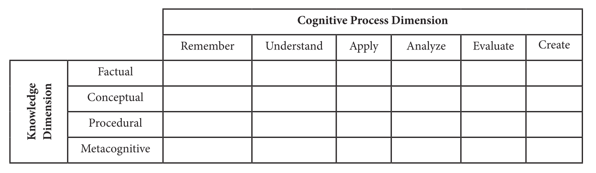

+++
title = "Plans Change - Did a reading, discussed other stuff!"
author = ["John Hammond"]
tags = ["teaching"]
date = 2024-03-28
draft = false
hideMeta = false
mathjax = false
ShowCodeCopyButtons = false
ShowBreadCrumbs = false
showReadingTime= false
summary= "Initially planned to discuss pages 59-66 of the guide on summative assessment."
slug = "instructional-guide-5"
thumbAlt = "Unsplash photo by Ben Mullins"
+++

Originally, we planned to discuss summative assessment informed by our reading. However, we began having a very productive conversation regarding having difficult academic conversations with our students (in particular, the pros and cons of recommending a student withdraw rather than take a failing grade). We also discussed our semesters in general, and it was a very good and needed conversation.

## Initial Draft: 
We continue our series of reading and working through the [MAA Instructional Practices Guide](https://nextcloud.math.wichita.edu/index.php/s/T82WC4YNSizG5km). This is part 5, in which we review pages 59-66 on the basics of assessment. 

### Thinking about course grades

The text begins by contrasting a traditional grading system with one that uses portfolios. It then makes reference to [non-traditional grading](../../../../posts/2023/non_traditional_grading1/).

#### Modified Bloom's taxonomy

The text shares a two-dimensional variation on Bloom's Taxonomy referring to Anderson, et.al[^1]:

[^1]: Anderson, L.W., Krathwohl, D.R., Airasian, P.W., Cruikshank, K.A., Mayer, R.E., Pintrich, P.R., Raths, J., and Wittrock, M.C. (2001). A Taxonomy for Learning, Teaching, and Assessing: A Revision of Bloom’s Taxonomy of Educational Objectives, Complete Edition. New York: Pearson.