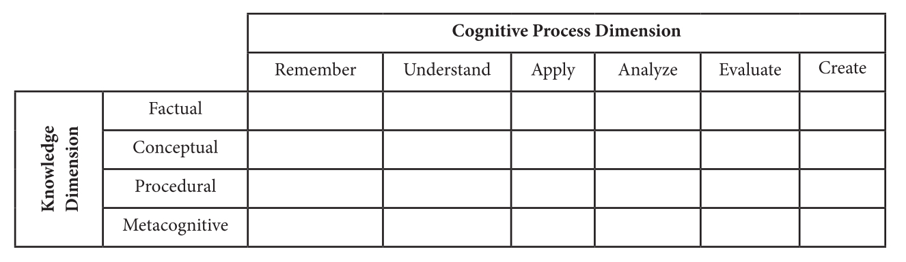

+++
title = "Planning for Finals - Reviewing an Assessment"
author = ["John Hammond"]
tags = ["teaching"]
date = 2024-04-04
draft = false
hideMeta = false
mathjax = false
ShowCodeCopyButtons = false
ShowBreadCrumbs = false
showReadingTime= false
summary= "Reviewing a previous final with the lens of good summative assessment practices."
thumbAlt = "a photo of the pile of questions we're reviewing."
+++

In today's teaching seminar, we're reviewing questions from a previous final exam in a course.  I've cut up the three copies of the exam into individual questions and we're going to distribute them among three groups.  Each group will then evaluate each question along the two-dimensional variation on Bloom's Taxonomy by Anderson, et.al[^1] shared in the MAA Instructional Practices Guide:

After each group reviews all of the questions, we'll get together and discuss it all together.

The goal is to see if we're actually assessing what the author of the test might have thought they were assessing.  Everyone in attendance has taught the class at least once, and two of us (me included) have in the past written the exams, so this will be a very good experience for everyone.

[^1]: Anderson, L.W., Krathwohl, D.R., Airasian, P.W., Cruikshank, K.A., Mayer, R.E., Pintrich, P.R., Raths, J., and Wittrock, M.C. (2001). A Taxonomy for Learning, Teaching, and Assessing: A Revision of Bloom’s Taxonomy of Educational Objectives, Complete Edition. New York: Pearson.